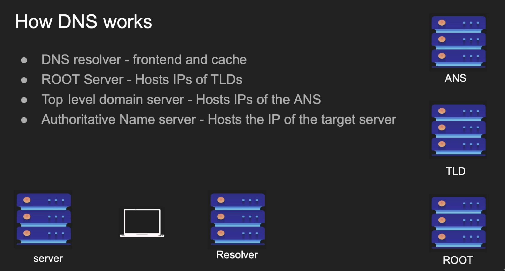
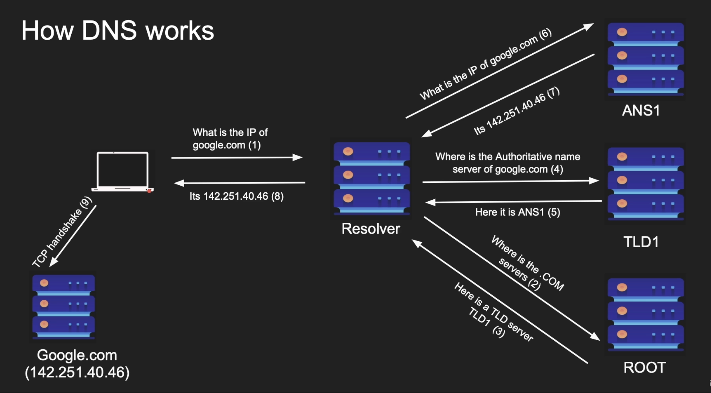
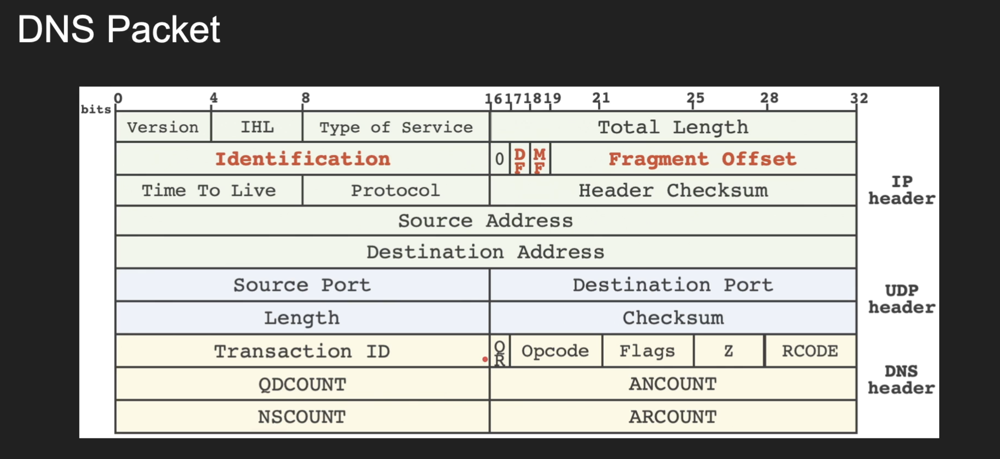

# DNS / Domain Name Service

We are using `Public IP Address` for external communcation
But we can't memorize specific numbers / sequence
So instead of that we are using address system. But now we have to map that address with ip address

If you have `IP Address`, then if you want `MAC Address`, we use `ARP`

If you have the name and then you want `IP Address`, we use `DNS`

Build on top of `UDP`

`Port 53` is the reserved port for `DNS`

It has many records (`TXT`, `A`, `CNAME`, `MX`).
[READ MORE ABOUT DNS RECORDS](dns_records.md)

 

## How DNS Works

These servers are nicely partitioned. So it becomes easy to search

 

## DNS Packet Anatomy

