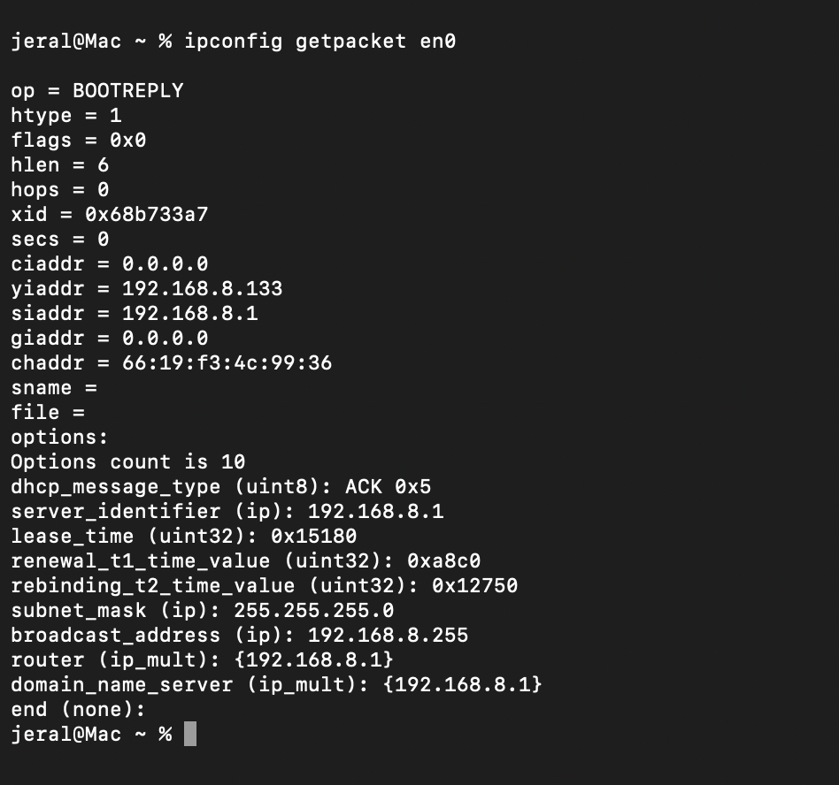

# DHCP

`Dynamic Host Configuration Protocol (DHCP)` is a network management protocol used to `automatically assign IP addresses` and `network configuration settings` to devices connecting to a network. 

Operating at the Application Layer, it eliminates the need for network administrators to manually configure each device.

On a standard home or small office network, the DHCP server is built directly into your network router. On corporate or enterprise networks, it is usually hosted on a dedicated server or a network switch

<br/>

## What Settings Does DHCP Provide?

Beyond a unique IP address, a DHCP server provides core parameters defined via DHCP options:

- **IP Address**: The unique digital identity for the device.
- **Subnet Mask**: Defines the boundary and size of the local network.
- **Default Gateway**: The router IP used to send traffic outside the local network.
- **DNS Servers**: Addresses used to translate human-readable names (like google.com) into IPs.

<br/>

## How It Works: The DORA Process


DHCP runs on top of the User Datagram Protocol (UDP), utilizing Port 67 for the server and Port 68 for the client. When a client connects, it follows a 4-step handshake known as DORA:

```bash
[ Client ]                                     [ DHCP Server ]

    |                                                |
    | ------- 1. DHCPDISCOVER (Broadcast) ---------> |
    |                                                |
    | <------ 2. DHCPOFFER (Unicast/Broadcast) ------|
    |                                                |
    | ------- 3. DHCPREQUEST (Broadcast) ----------> |
    |                                                |
    | <------ 4. DHCPACK (Unicast/Broadcast) --------|
```

**Discover (DHCPDISCOVER)**: The client has no IP address yet. It sends a broadcast message (\(255.255.255.255\)) out to the entire local network to locate any available DHCP servers.

**Offer (DHCPOFFER)**: Any DHCP server that receives the request reserves an available IP address from its pool and sends an offer back to the client. This offer includes the proposed configuration and lease terms.

**Request (DHCPREQUEST)**: The client accepts the offer (usually the first one it receives) and broadcasts a request. Broadcasting this ensures that all other DHCP servers know their offers were declined and can release their reserved IPs back into their pools.

**Acknowledge (DHCPACK)**: The chosen server sends a final confirmation packet. It officially binds the configuration to the client’s physical MAC address, allowing the device to start network communication.

<br/>

## Debug DHCP



<br/>


## Benefits

`No IP Conflicts`: The server ensures no two active devices receive the same IP.

`Automation`: Devices like smartphones and laptops seamlessly hop from home to office Wi-Fi networks without human configuration.

`Central Management`: Network administrators change settings (like a new DNS address) once on the server, and all clients pick it up automatically.
