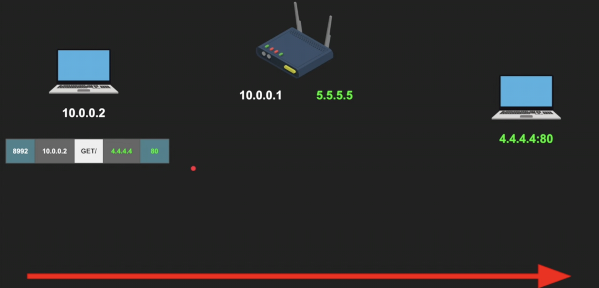
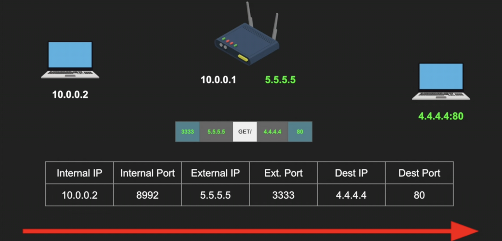
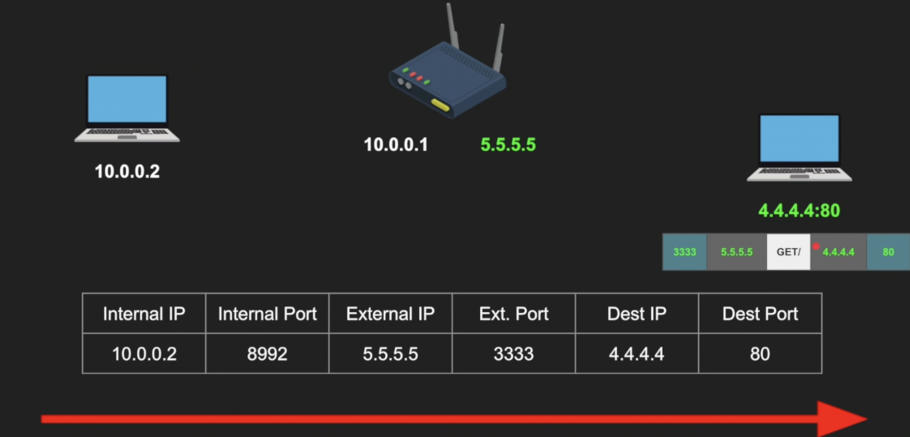
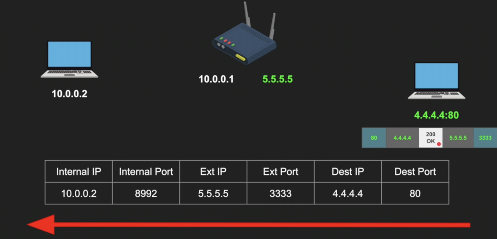
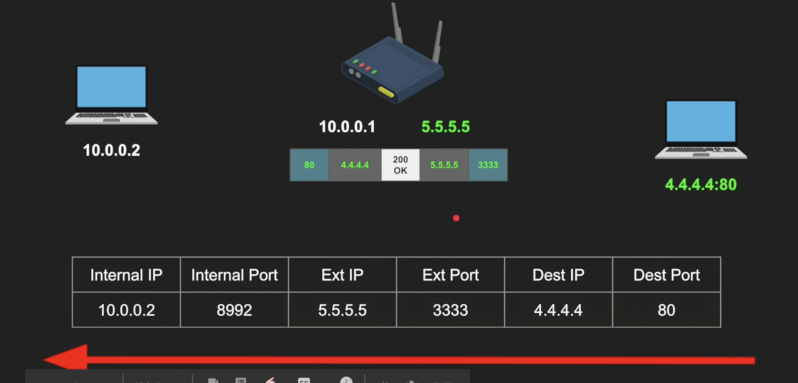
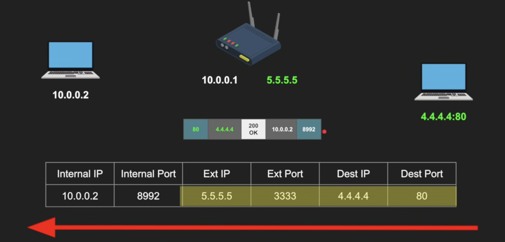
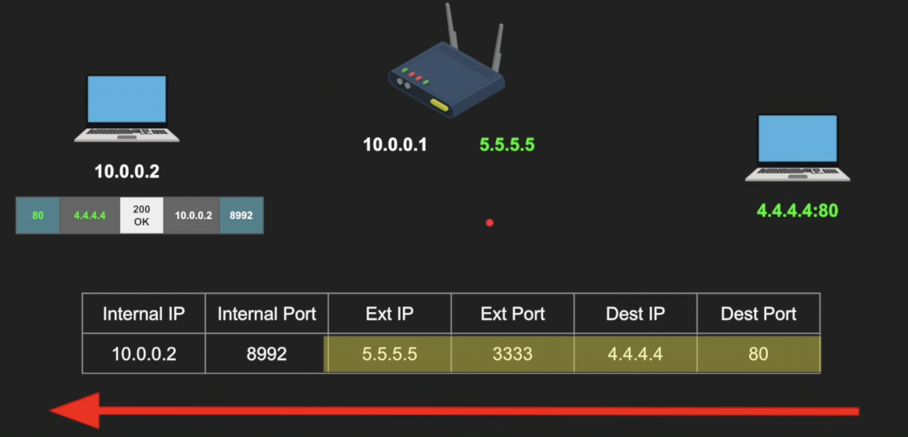

# NAT / Network Address Translation

`Network Address Translation (NAT)` allows multiple devices in a private network to access the internet using a single public IP address

It helps conserve IPv4 addresses and hides internal systems for added security

- Translates private IP addresses into public IP addresses and vice versa
- Reduces IPv4 shortage by allowing multiple devices to share one public IP
- Hides internal network addresses from external networks
- Uses port mapping (PAT) to manage multiple device connections simultaneously

 

## How This Works

NAT ways to function is listed as below:

- A device sends a request, reaches the NAT enabled router.
- Router replaces the private IP with its public IP and assigns a unique port.
- NAT stores this mapping in the NAT table.
- When the server responds, NAT uses the stored entry to send the packet to the correct internal device.

 

## NAT Translation Methods

These methods define how a router maps internal private IP addresses to external public IP addresses for internet communication.

### 1. Static NAT (One-to-One)
* **Definition:** Maps one private IP address to one permanent, dedicated public IP address.
* **Use Case:** Used primarily for hosting internal web servers, mail servers, or application servers.
* **Inbound Access:** Allows outside devices on the internet to initiate connections to the internal server directly.
* **Requirement:** Requires a unique, dedicated public IP address for each individual internal server.

### 2. Dynamic NAT (Many-to-Many)
* **Definition:** Maps an internal private IP address to an available public IP address from a configured pool.
* **Behavior:** Assignments happen automatically on a first-come, first-served basis as devices request internet access.
* **Use Case:** Used in corporate environments when multiple public IP addresses are available but not enough for every device.
* **Limitation:** Breaks active connection requests if the public IP pool runs completely out of available addresses.

### 3. PAT / NAT Overload (Many-to-One)
* **Definition:** Maps multiple private IP addresses to a single, shared public IP address.
* **Tracking:** Uses unique source port numbers to distinguish and track separate connections from different devices.
* **Use Case:** The standard method used in almost all home routers and small office networks.
* **Benefit:** Conserves limited IPv4 addresses by allowing an entire network to share one public IP address.

 

## NAT Behavioural Methods / Filter Types

These four categories describe how a firewall handles incoming UDP traffic based on the sender's origin IP address and port number.

### 1. One-to-One NAT / Static (Full-Cone NAT)
* **Definition:** Maps an internal IP address and port to a fixed external IP address and port.
* **Behavior:** Any external host can send data to the internal device via the mapped external port without prior contact.
* **Security:** Lowest security profile among all NAT types.
* **Gaming Match:** **Open NAT**. Ideal for hosting multiplayer games.

### 2. Address-Restricted NAT (Restricted-Cone NAT)
* **Definition:** Restricts incoming traffic based solely on the external sender's IP address.
* **Behavior:** The internal device must first send an outbound packet to an external server's IP address. That specific external IP can then send data back through any source port.
* **Security:** Medium security profile.
* **Gaming Match:** **Moderate NAT**.

### 3. Port-Restricted NAT (Port-Restricted Cone NAT)
* **Definition:** Restricts incoming traffic based on both the external sender's IP address and port number.
* **Behavior:** The internal device must first send an outbound packet to a specific external IP and port. The external server can only reply if both its IP and port match that destination exactly.
* **Security:** High security profile.
* **Gaming Match:** **Moderate NAT**.

### 4. Symmetric NAT
* **Definition:** Allocates a brand-new, unique external port for every single distinct external destination requested.
* **Behavior:** If one internal device communicates with two different external servers, the router assigns two completely different external ports. Only the exact destination receiving the packet can respond.
* **Security:** Highest security profile.
* **Gaming Match:** **Strict NAT**. Frequently causes matchmaking failures and blocks peer-to-peer (P2P) connections.

 

## Advantages

- Conserves public IPv4 addresses
- Allows multiple devices to share a single public IP
- Hides internal IP addresses from external networks
- Improves privacy by masking internal network structure

## Disadvantages

- Breaks end-to-end connectivity
- Can cause issues with VoIP, gaming, and peer-to-peer applications
- Adds processing overhead on the router
- Makes direct peer-to-peer communication more complex
