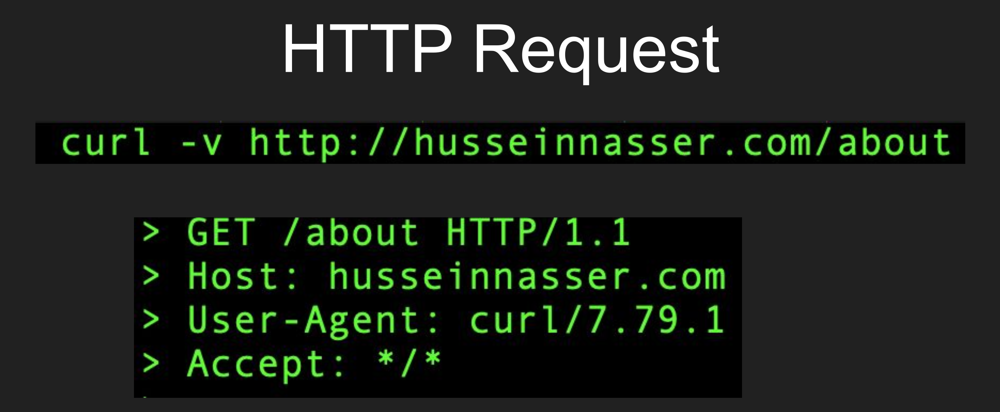
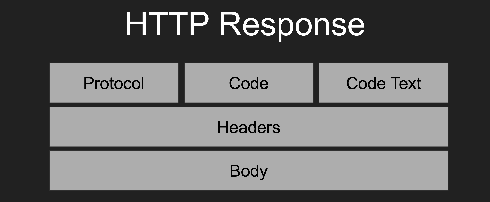
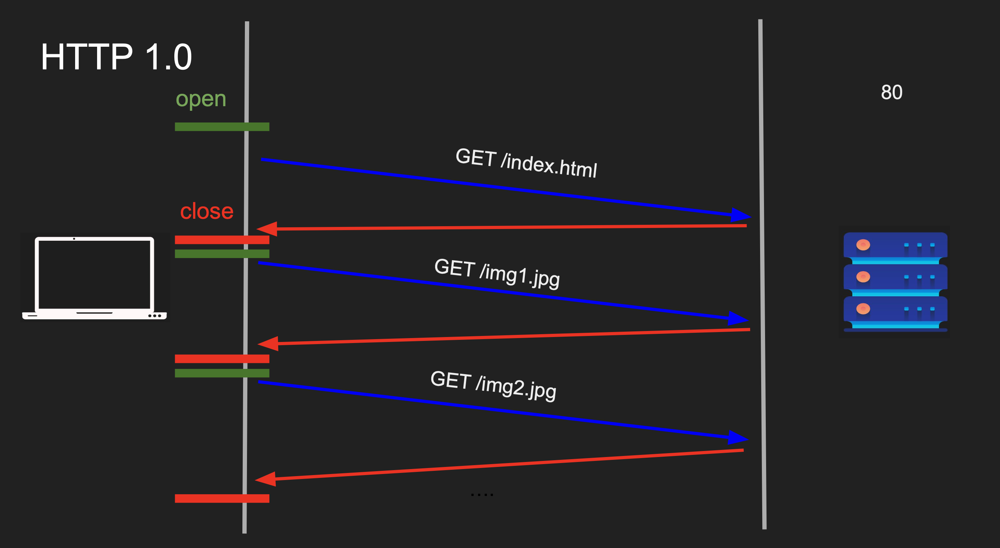
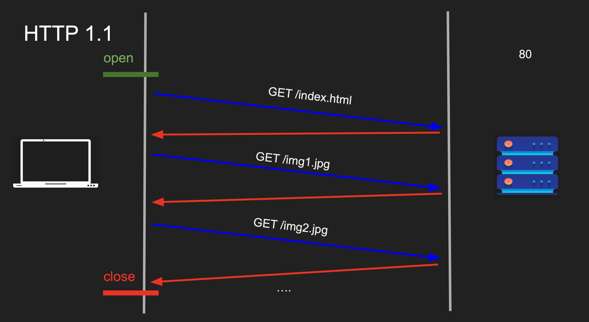
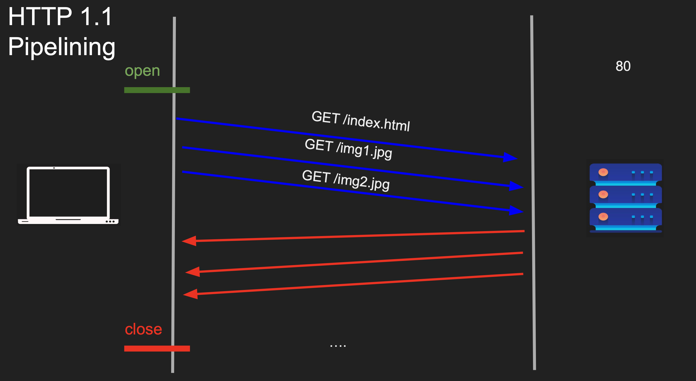
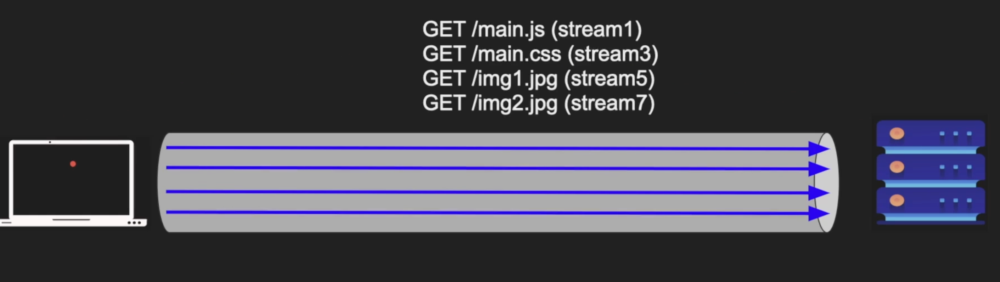
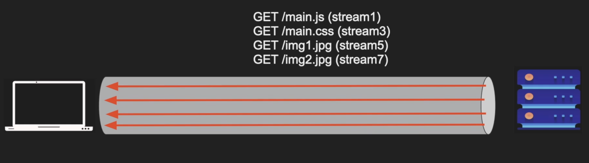
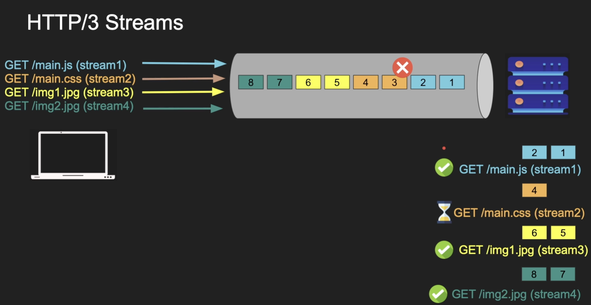

# HTTP

- Hyper Text Transfer Protocol
- Application layer protocol

---

## HTTP Request

 

## HTTP Response

 

## HTTP Versions

### HTTP 1.0

- New TCP connection for each request
- Slow
- Buffering / Chunking (transfer-encoding:chunked didn’t exist in HTTP 1.0)
- No multi-homed websites (HOST header)
- No long polling

### HTTP 1.1

- Persisted TCP Connection
- Low Latency & Low CPU Usage
- Streaming with Chunked transfer
- Pipelining (disabled by default)
- Proxying & Multiple websites on single IP

Pipeline is disable by default and we can enable that
In the pipeline way order should be critical
Even when images are ready to server for client, still server holds until html ready to serve

### HTTP 2

Uses the same TCP conenction and it's a persistent TCP connection until gets the response back

Requests and responses are working concurrently

Pros:
● Multiplexing over Single Connection (save resources)
● Compression (Headers & Data)
● Server Push
● Secure by default
● Protocol Negotiation during TLS (ALPN)

Cons:
● TCP head of line blocking
● Server Push never picked up
● High CPU usage

### HTTP 3

`HTTP3` means that `HTTP` + `QUIC` protocols

# Pros

- 1 step handshake with TLS (one round trip)
- Has congession control
- has a connection (every datagram labled with connectionID)
