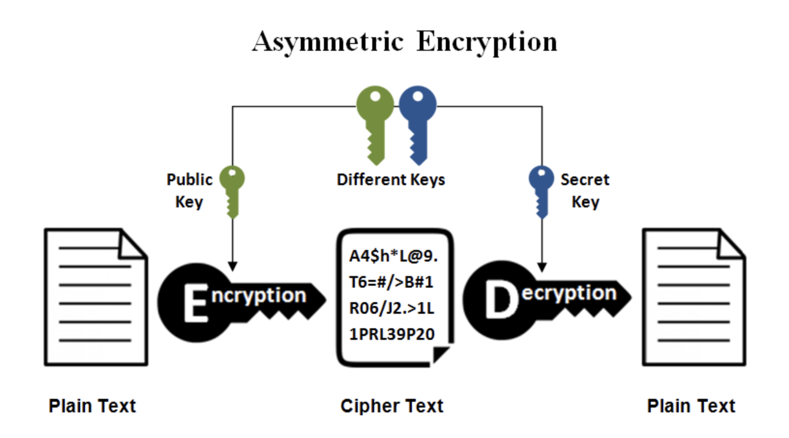
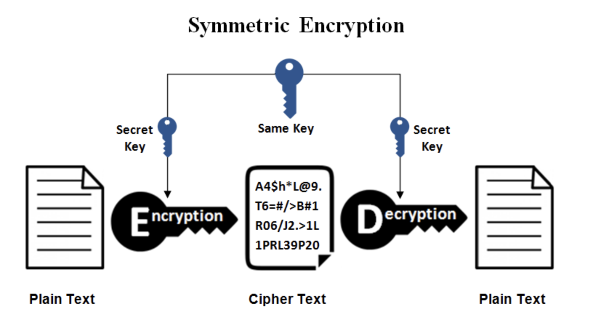
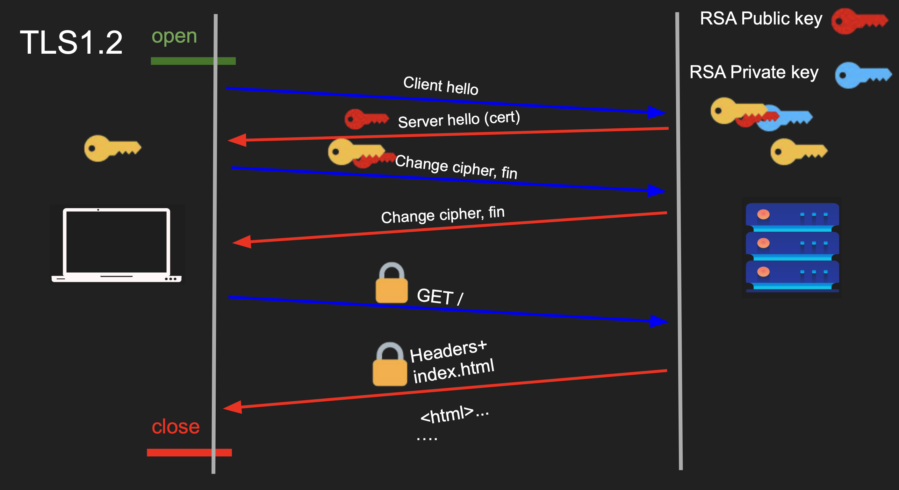
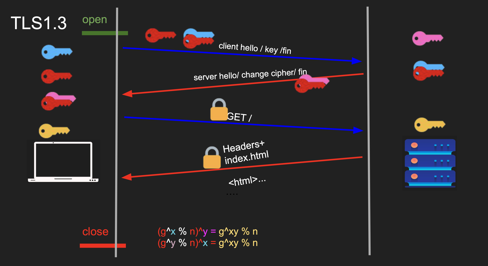

# TLS / Transport Layer Security

- In `HTTP` data is transfer by plain text format and anyone can see the data if they catch data packets

`TLS (Transport Layer Security)` is the industry-standard cryptographic protocol designed to secure communications over a computer network.
It primarily encrypts data in transit between a client (like your web browser) and a server, preventing attackers from intercepting or tampering with sensitive information.

 

## Encryption Types

### Asymetric Encription

`Asymmetric encryption` (public-key cryptography) is a method that uses two mathematically linked keys

A public key to encrypt data and a private key to decrypt it

Because the public key can be shared openly, it eliminates the need to securely exchange secret keys beforehand, making secure communication universally accessible

### Symetric Encription

`Symmetric Encryption` is a cryptographic method that uses a single, shared secret key to both encrypt and decrypt data

It is incredibly fast and resource-efficient, making it the industry standard for securing bulk data, files, and entire disks

 

## How TLS Works

TLS works with a combination of both 2 encryption methods

