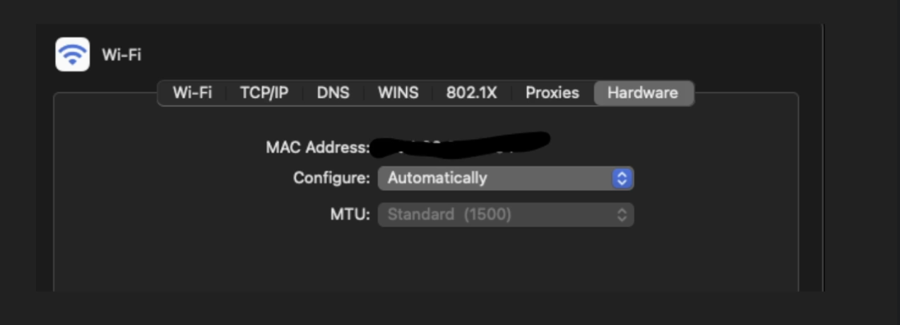
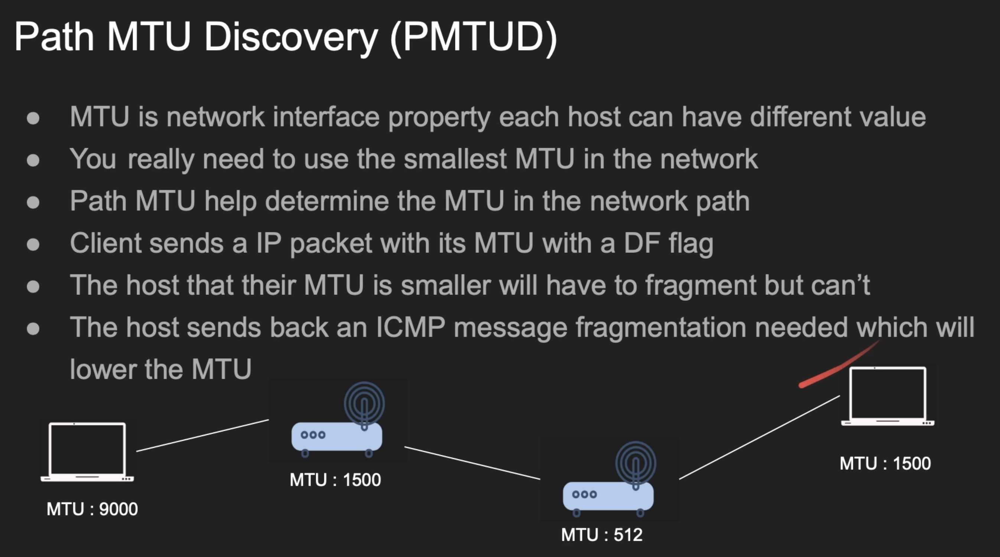

# Maximum Transmission Unit / MTU

`Maximum Transmission Unit (MTU)` is fundamentally a property of the Network Interface Card (NIC)

It defines the largest packet size that your network interface (NIC) can send or receive at the data link layer (Layer 2)

This also defines the size of the frame which is layer 2 (`Wifi Ethernet` / `Ethernet`)

That's why `IP MTU` and `Frame MTU` both are same



---

Some networks can have `Jumbo Frames` upto 9000 bytes

In that case, it will either be forcefully chopped into smaller pieces (fragmented) or completely dropped

---

Here is the exact mathematical breakdown of how your image gets sliced based on the protocol you choose:

**1. If sending via TCP (HTTP, WebSockets, standard TCP sockets)**

TCP splits data using the Maximum Segment Size (MSS), which is `1,460 bytes`.

```bash
 2 KB Image Payload (2,048 Bytes Total)
 [==============================================================]
 
 Split into TCP Chunks:
 [==========================================] [==================]
          Packet 1: 1,460 Bytes                  Packet 2: 588 Bytes
```

**2. If sending via UDP (Custom fast-streaming sockets)**

UDP allows a maximum payload of `1,472 bytes` per packet before hitting the 1500-byte MTU barrier.


---

But in the network can have multiple devices and those can have different MTUs. So how can we find the lowest MTU in that path.


