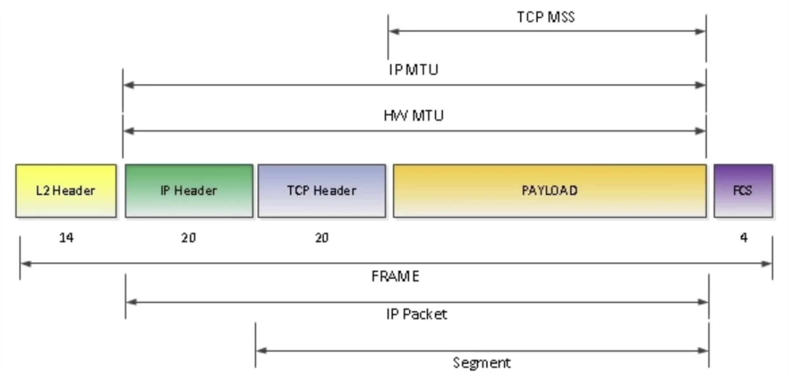

# Maximum Segement Size / MSS

`MSS` stands for `Maximum Segment Size`.
It is a parameter at the transport layer that defines the largest amount of data (in bytes) a device can receive in a single TCP segment, excluding all protocol headers

```bash
MSS = MTU - IP Headers - TCP Headers
    = 1500 - 20 - 20
    = 1460
```

So if you send `1460 bytes` / `1.46Kb`, it will fit into a `one segment` nicely which is `one frame`


